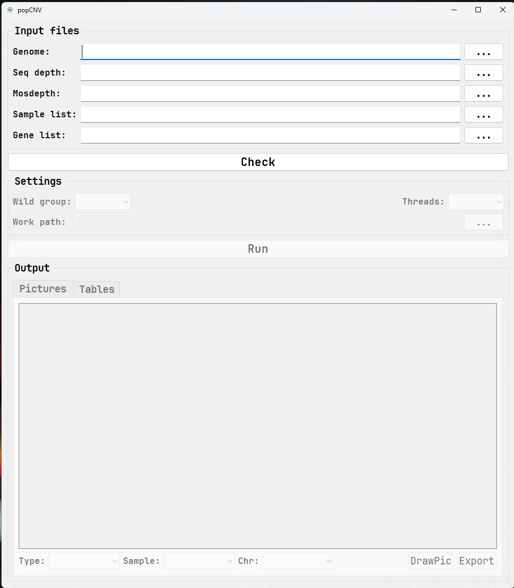

## Introduction

This software is used for calculating copy number of genes, and get top 5% genes which selected by humans.

## popCNV CLI version

###  Dependencies

Python modules:
 - numpy
 - scipy
 - pysam
 - pathos

Software:
 - [mosdepth](https://github.com/brentp/mosdepth)

### Installation

```sh
cd /path/to/install
git clone https://github.com/sc-zhang/popCNV.git
cd popCNV.py
chmod +x popCNV.py
echo 'export PATH=/path/to/install/popCNV.py:$PATH' >> ~/.bash_profile
source ~/.bash_profile
```

### Usage
**Notice:** you need add <kbd>mosdepth</kbd> to your <kbd>PATH</kbd>
```sh
usage: popCNV.py [-h] -g GENOME -b BAM [-s WIN_SIZE] -l LIST -w WORKDIR --group GROUP --wild WILD [-t THREADS]

options:
  -h, --help            show this help message and exit
  -g GENOME, --genome GENOME
                        Input genome fasta file
  -b BAM, --bam BAM     Directory of bam files
  -s WIN_SIZE, --win_size WIN_SIZE
                        window size, default=1000
  -l LIST, --list LIST  List file contain 4 columns: chromosome_name start_position end_position gene_name
  -w WORKDIR, --workdir WORKDIR
                        Working directory
  --group GROUP         Group file contain 2 columns: sample_name group_name(without space)
  --wild WILD           Wild group id
  -t THREADS, --threads THREADS
                        Threads
```

### Results
| File/Directory        | Description                                                                                                                                                                                                                                                       |
|-----------------------|-------------------------------------------------------------------------------------------------------------------------------------------------------------------------------------------------------------------------------------------------------------------|
| **06.genes.round.cn** | Copy number of genes in all groups                                                                                                                                                                                                                                |
| **07.RFD**            | RFD is relative frequency difference which was calculated based on wild group</br> a) a set of list files named with group_name, contain a list of genes with top 5% of RFD based on p<0.05</br>b) total.list contains all RFD and p-value of genes in all groups |

> Notice: RFD is defined as:  
> $$RFD\ (Relative\ Frequency\ difference) = \frac{F_{cultivar}-F_{wild}}{F_{population}}$$

## popCNV GUI version

### Installation
Download executable file in releases.

### Usage
**Notice:** you need run <kbd>mosdepth</kbd> with same window size for all your samples, and get sequence depth of all samples manually.  
```sh
# For windows user, just run gpopCNV.exe, for other platform like linux and macOS,
# use command below to run gpopCNV
python3 gpopCNV.py
```
The main form is like below:

